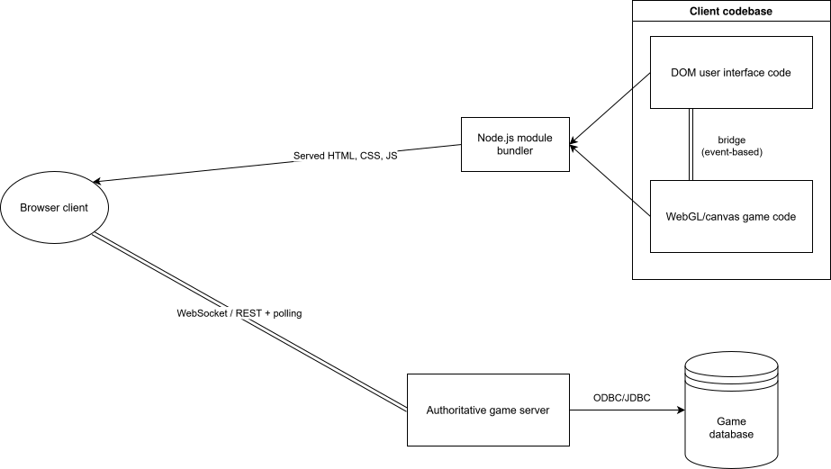

# Technický design

Tento dokument popisuje softwarový návrh aplikace z hlediska architektury, použitých techonologií a návrhu komponent/subsystémů.

## High level architektura

Hra je realizována jako standardní webová aplikace. Klientská část běží plně v desktopovém moderním prohlížeči s využitím WebGL, případně HTML5 canvasu, pro vykreslování herní grafiky.
UI elementy jsou sestaveny z Single-Page Application komponentního frameworku a vkládány do DOM aplikace přes vrstvu nad herním plátnem.

Komunikace mezi klienty a klasickým autoritativním serverem probihá přes WebSockets (případně pouze REST API s pravidelným pollingem z klienta, pokud by se ukázalo dostačující z hlediska latence).
Serverová část zajišťuje vyhodnocování herní logiky, validaci akcí hráčů a správu herního stavu, včetně synchronizace mezi klienty a perzistencí do databáze.

Možný výběr technologií:

- Klient:
	- Phaser nebo pixi.js pro herní vrstvu
	- Vue/Svelte/Angular/... pro UI komponentní vrstvu
	- maximální využití TypeScriptu
	- build systém - aktuálně vyvíjeno/testováno s Vite
	- Jest pro unit testy
- Server:
	- Framework/jazyk: nejvíce zkušeností s ASP.NET Core (C#) a Spring Boot (Java), ale otázka integrace WebSockets
		- možnost přechodu na Node.js s Express (+ Socket.IO), pokud by se ukázal výhodnější čistě TypeScript vývoj
		- unit testing v rámci frameworku
	- Databáze: PostgreSQL nebo MongoDB dle vlastností perzistovaného herního stavu
